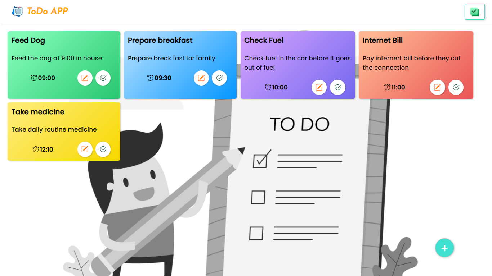
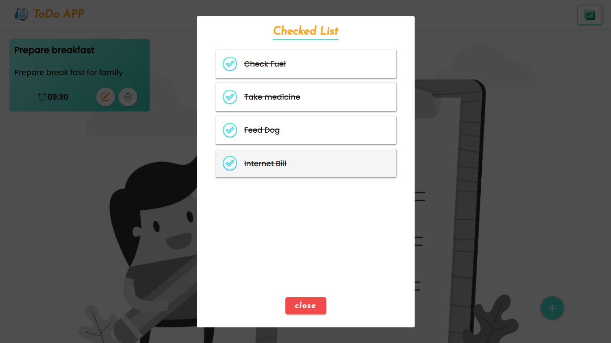
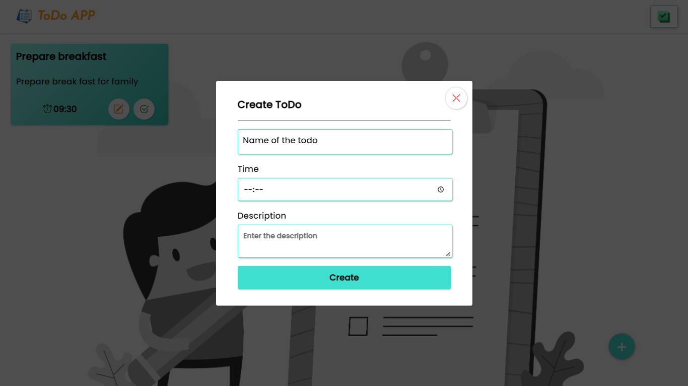

# Todoapp
 
<a href="https://logeshwars.github.io/Todoapp-JS/" target="_blank">🔗 Vist site</a>

## Responsive Todo app using Javascript and HTML CSS

### In this website the user can monitor their daytoday activites with time

### User can  monitor the finished tasks

### The browser's localstorage is used for database

